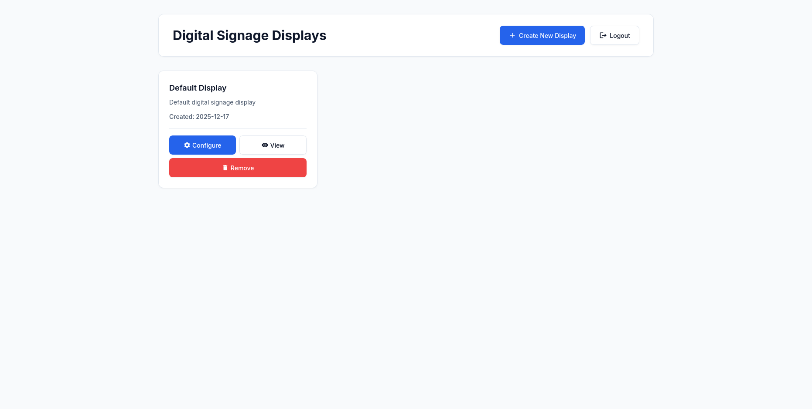
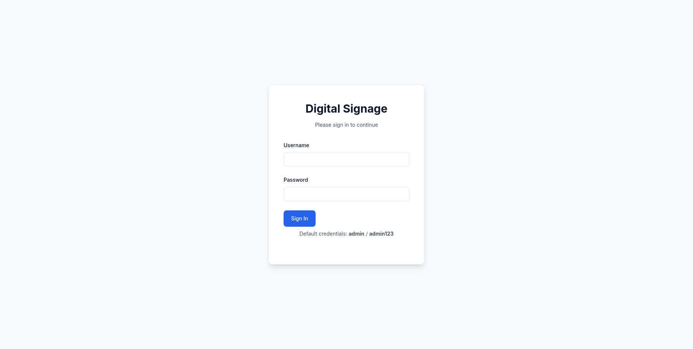
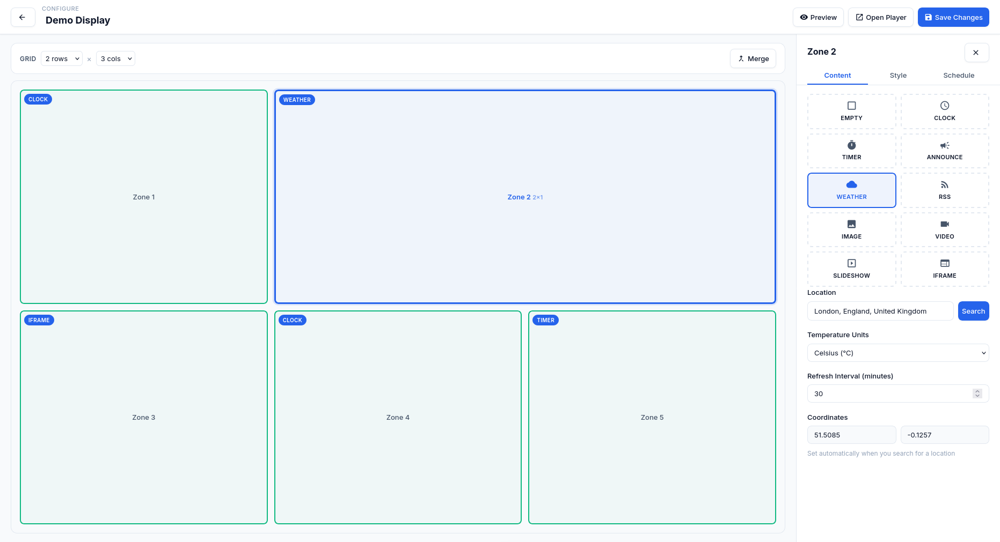
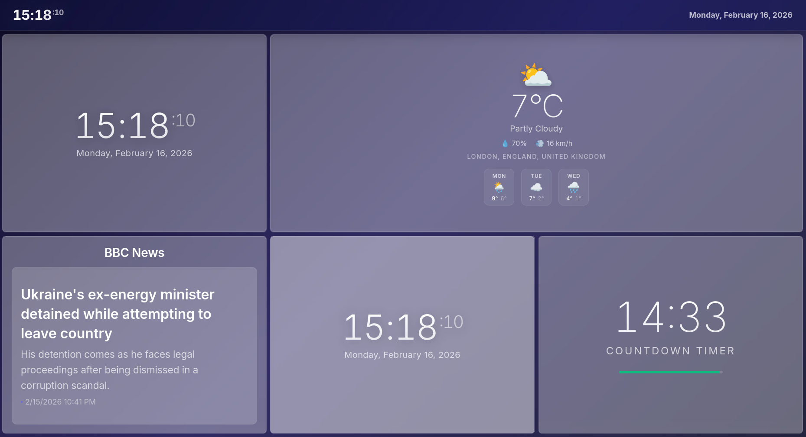

# Digital Signage

A browser-based digital signage application built with Flask and vanilla JavaScript.



## Quick Start

```bash
git clone https://github.com/AiryAir/signage2
cd signage2

# Linux/macOS
./run.sh

# Windows (PowerShell)
.\run.ps1
```

Open `http://localhost:5000` in your browser.

**Default credentials:** `admin` / `admin123`

## Features

- **Widgets**: Clock, countdown timer, announcements, RSS feeds, iframes, images, videos, slideshows
- **Layouts**: Configurable grid layouts (2x2, 3x2, 3x3, 4x4)
- **Customization**: Google Fonts, custom backgrounds, per-zone styling
- **Multi-display**: Manage unlimited displays from one dashboard

## Installation

### Linux / macOS

```bash
./run.sh
```

### Windows (PowerShell)

```powershell
.\run.ps1
```

### Docker

```bash
docker compose up -d
```

The run scripts automatically create a virtual environment and install dependencies.

## Usage

1. Login at `http://localhost:5000`
2. Create a new display
3. Configure the grid layout and add widgets to each zone
4. Open the player URL in fullscreen on your display device

## Reset Password

```bash
python3 reset-password.py
```

## Screenshots

| Login | Config | Player |
|-------|--------|--------|
|  |  |  |

## License

Open source. Use freely.
