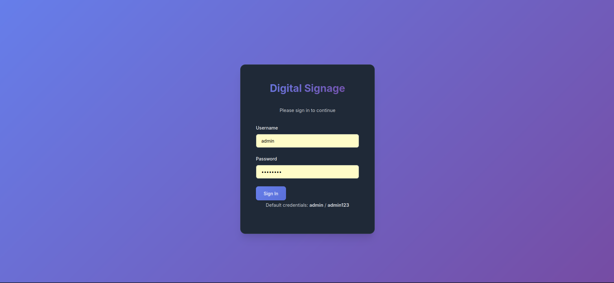

# Digital Signage

[](https://claude.ai)

A browser-based digital signage application built with Flask and vanilla JavaScript.


## Quick Start

```bash
git clone https://github.com/AiryAir/signage2
cd signage2

# Linux/macOS
./run.sh

# Windows (PowerShell)
.\run.ps1
```

Open `http://localhost:5000` in your browser.

**Default credentials:** `admin` / `admin123`

## Features

### Widgets
- **Clock** — configurable 12/24h time format, multiple date formats
- **Countdown Timer** — with progress bar and color-coded warnings
- **Announcements** — static, crossfade carousel, or marquee scroll modes
- **RSS Feeds** — list, rotate, or ticker display modes
- **iframes** — embed any web content
- **Images** — single image with cover fit
- **Videos** — local files or YouTube embeds with autoplay
- **Slideshows** — multi-image with configurable timer and crossfade
- **Weather** — current conditions, 3-day forecast via Open-Meteo API (no API key needed), geocoding search

### Layout & Display
- **Configurable Grid** — 1x1 up to 4x4 layouts
- **Zone Spanning** — zones can span multiple columns and rows for flexible layouts
- **Screen Orientation** — landscape, portrait, or auto-detect modes
- **Google Fonts** — 30+ font options for global and per-zone typography
- **Zone Backgrounds** — transparent, solid color, glassmorphism, or image per zone
- **Top Bar Modes** — always visible, overlay, auto-hide, or hidden

### Management
- **Multi-Display** — manage unlimited displays from one dashboard
- **Remote Management** — heartbeat polling with online/offline status indicators
- **Auto-Refresh** — displays auto-detect config changes and refresh within 30 seconds
- **Live Preview** — real-time iframe preview on the config page updates as you edit
- **Content Scheduling** — time-based and day-of-week content overrides per zone

## Installation

### Linux / macOS

```bash
./run.sh
```

### Windows (PowerShell)

```powershell
.\run.ps1
```

### Docker

```bash
docker compose up -d
```

The run scripts automatically create a virtual environment and install dependencies.

## Usage

1. Login at `http://localhost:5000`
2. Create a new display
3. Configure the grid layout and add widgets to each zone
4. Open the player URL in fullscreen on your display device

### Weather Widget
1. Add a zone and set type to "Weather"
2. Enter a city name and click "Search" to geocode
3. Choose temperature units (C/F) and refresh interval

### Zone Spanning
1. Open a zone's config modal
2. Set Column Span or Row Span > 1
3. The zone will cover multiple grid cells

### Content Scheduling
1. Open a zone's config modal (announcement, image, video, slideshow, iframe, or RSS)
2. Click "Add Schedule" to create time-based content overrides
3. Set start/end times, select active days, and enter override content
4. Base content is used when no schedule matches

### Remote Management
- Display cards show green "Online" / grey "Offline" badges
- Players send heartbeats every 30 seconds
- Config saves are auto-detected by players and trigger a refresh

## Reset Password

```bash
python3 reset-password.py
```

## Screenshots

| Login | Config | Player |
|-------|--------|--------|
|  |  |  |

## License

Open source. Use freely.
