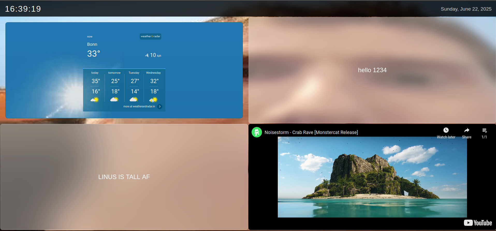
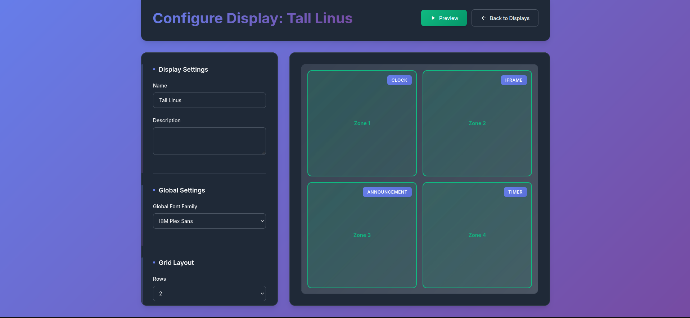

# Digital Signage

[](https://claude.ai)

A browser-based digital signage application built with Flask and vanilla JavaScript.



## Quick Start

```bash
git clone https://github.com/AiryAir/signage2
cd signage2

# Linux/macOS
./run.sh

# Windows (PowerShell)
.\run.ps1
```

Open `http://localhost:5000` in your browser.

On first run, you'll be prompted to set an admin username and password.

## Features

### Widgets
- **Clock** — configurable 12/24h time format, multiple date formats
- **Countdown Timer** — with progress bar and color-coded warnings
- **Announcements** — static, crossfade carousel, or marquee scroll modes
- **RSS Feeds** — list, rotate, or ticker display modes
- **iframes** — embed any web content
- **Images** — single image with cover fit
- **Videos** — local files or YouTube embeds with autoplay
- **Slideshows** — multi-image with configurable timer and crossfade
- **Weather** — current conditions, 3-day forecast via Open-Meteo API (no API key needed), geocoding search

### Layout & Display
- **Configurable Grid** — 1x1 up to 4x4 layouts
- **Zone Merging** — select and merge adjacent zones into larger spans, split them back
- **Screen Orientation** — landscape, portrait, or auto-detect modes
- **Google Fonts** — 30+ font options for global and per-zone typography
- **Zone Backgrounds** — transparent, solid color, glassmorphism, or image per zone
- **Global Backgrounds** — solid color, CSS gradients, or uploaded images
- **Top Bar Modes** — always visible, overlay, auto-hide, or hidden

### Configuration
- **Two-Panel Editor** — Figma-style layout with grid preview on the left and context panel on the right
- **Inline Editing** — click a zone to edit; no modals, changes save to state instantly
- **Zone Type Picker** — visual card grid with icons instead of dropdowns
- **Tabbed Zone Editor** — Content, Style, and Schedule tabs per zone
- **Accordion Settings** — collapsible global settings sections (background, typography, top bar, orientation)
- **Live Preview** — toggle a slide-out panel with real-time iframe preview
- **Toast Notifications** — non-blocking feedback replaces alert dialogs
- **Unsaved Changes Warning** — pulsing save button and beforeunload prompt

### Management
- **Multi-Display** — manage unlimited displays from one dashboard
- **Remote Management** — heartbeat polling with online/offline status indicators
- **Auto-Refresh** — displays auto-detect config changes and refresh within 30 seconds
- **Content Scheduling** — time-based and day-of-week content overrides per zone

## Installation

### Linux / macOS

```bash
./run.sh
```

### Windows (PowerShell)

```powershell
.\run.ps1
```

### Docker

```bash
docker compose up -d
```

The run scripts automatically create a virtual environment and install dependencies.

## Usage

1. Login at `http://localhost:5000`
2. Create a new display from the dashboard
3. Click **Configure** to open the two-panel editor
4. Use the grid toolbar to set rows/columns, or merge zones together
5. Click a zone to select it — the right panel shows Content, Style, and Schedule tabs
6. Pick a zone type from the card grid, configure its settings
7. Adjust global settings (background, font, top bar) by clicking outside all zones
8. Hit **Save Changes** in the header to persist to the server
9. Open the player URL in fullscreen on your display device

### Weather Widget
1. Click a zone and set type to "Weather"
2. Enter a city name and click **Search** to geocode
3. Choose temperature units (C/F) and refresh interval

### Zone Merging
1. Click **Merge** in the grid toolbar
2. Click zones to select them (must form a rectangle)
3. Click **Apply Merge** — the zones combine into one
4. To split, hover a merged zone and click the split icon

### Content Scheduling
1. Select a zone (announcement, image, video, slideshow, iframe, or RSS)
2. Switch to the **Schedule** tab
3. Click **Add Schedule** to create time-based content overrides
4. Set start/end times, select active days, and enter override content

### Remote Management
- Display cards show green "Online" / grey "Offline" badges
- Players send heartbeats every 30 seconds
- Config saves are auto-detected by players and trigger a refresh

## Reset Password

Run `./run.sh` (or `.\run.ps1`) and choose option **3** from the menu.

## Screenshots

| Player | Config | Dashboard |
|--------|--------|-----------|
|  |  |  |

## License

Open source. Use freely.
